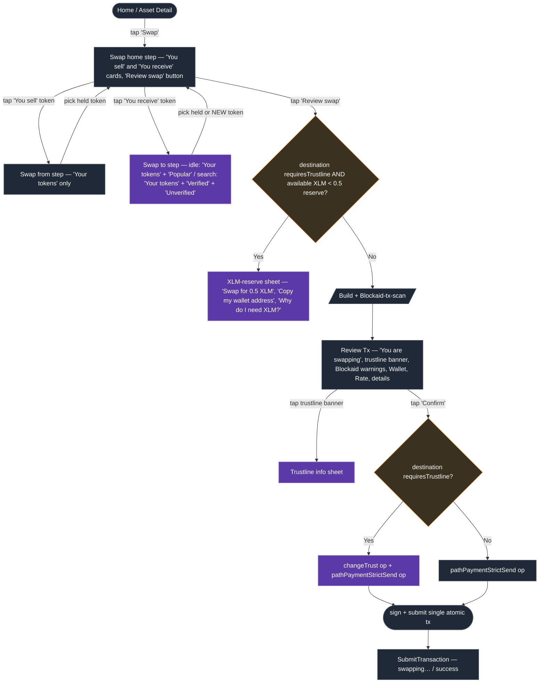

# Swap to New Token (Browser Extension) — Design Doc

> **Status:** Implemented (as-built) · **Author:** Cássio Goulart · **Date:** 2026-06-23 (design), reconciled against the shipped code 2026-07-02
>
> **Note:** This began as a pre-implementation design doc and has been updated to
> reflect what actually shipped on branch `feature/swap-to-new-token`. The
> "Decision" items below were all implemented; where the build diverged from the
> original plan, the text now describes the **as-built** behavior.
>
> **Reference (mobile):** This feature already shipped on freighter-mobile —
> PR [stellar/freighter-mobile#879](https://github.com/stellar/freighter-mobile/pull/879)
> and its design doc [`docs/swap-to-new-token-design.md`](https://github.com/stellar/freighter-mobile/blob/main/docs/swap-to-new-token-design.md).
> This document ports that work to the extension;
>
> **Figma ([Freighter Extension file](https://www.figma.com/design/C3G0a4Gd6RQyplRBppGDsL/Freighter-Extension?node-id=8629-18284&t=23iJx0ZSxxk26eJM-1)):** links are inline in §1.2 and §3.

This document has three main sections to facilitate the review:

- **§1 High-level design** — summary + architecture diagram.
- **§2 Differences from mobile** — the deltas and nuances vs the mobile design.
- **§3 Technical design** — implementation-grade detail.

---

## §1 — High-level design

### 1.1 Context & goal

Today the extension's Swap flow can only swap **between tokens the user already
holds** (assets with an existing trustline). To swap into a new asset, a user
must first leave Swap, complete the "Add asset" flow to create a trustline, and
only then return to Swap.

**Goal:** let users swap from a held token to **any Stellar classic asset** in a
single flow — discovering the destination through their own balances, a curated
**Popular tokens** list, and free-text search — and **bundling the `changeTrust`
operation into the swap transaction** when the destination has no trustline yet.

**Out of scope:** swapping to/from **Soroban custom tokens**. The flow stays
classic-only for now (Soroban contract tokens are filtered out at every stage);
Soroban support can come later behind the same discovery/routing seams.

### 1.2 What changes for users

| Area                             | Today                                 | After this work                                                                                                                                                                                                                                                                                                                                               |
| -------------------------------- | ------------------------------------- | ------------------------------------------------------------------------------------------------------------------------------------------------------------------------------------------------------------------------------------------------------------------------------------------------------------------------------------------------------------- |
| **Destination picker**           | Held balances only                    | A "Swap to" picker with **Your tokens**, **Popular tokens**, and (when searching) **Verified** / **Unverified** sections ([Figma — picker default](https://www.figma.com/design/C3G0a4Gd6RQyplRBppGDsL/Freighter-Extension?node-id=8641-35309), [search results](https://www.figma.com/design/C3G0a4Gd6RQyplRBppGDsL/Freighter-Extension?node-id=8641-35483)) |
| **Source picker**                | Held balances only                    | Unchanged in content — same "Swap from" picker, **Your tokens** only ([Figma](https://www.figma.com/design/C3G0a4Gd6RQyplRBppGDsL/Freighter-Extension?node-id=8641-33048))                                                                                                                                                                                    |
| **Trustline**                    | Manual, separate "Add asset" trip     | **Automatic** — bundled into the swap as one atomic transaction                                                                                                                                                                                                                                                                                               |
| **Security**                     | Only held assets are Blockaid-scanned | **Every** destination candidate (held, popular, search result) is Blockaid-scanned before it is selectable, and the combined transaction XDR is scanned at review                                                                                                                                                                                             |
| **New-trustline cost**           | Not surfaced                          | A purple **"This will add a trustline to {CODE}"** banner on review + a tappable info sheet explaining the 0.5 XLM reserve ([Figma — review](https://www.figma.com/design/C3G0a4Gd6RQyplRBppGDsL/Freighter-Extension?node-id=8641-34246), [info sheet](https://www.figma.com/design/C3G0a4Gd6RQyplRBppGDsL/Freighter-Extension?node-id=8641-34721))           |
| **Insufficient XLM for reserve** | On-chain failure                      | A pre-flight **"You need XLM to create a trustline"** sheet with a _Swap for 0.5 XLM_ helper + _Copy my wallet address_ ([Figma](https://www.figma.com/design/C3G0a4Gd6RQyplRBppGDsL/Freighter-Extension?node-id=8641-33468))                                                                                                                                 |

The Swap home screen has this shape ([Figma](https://www.figma.com/design/C3G0a4Gd6RQyplRBppGDsL/Freighter-Extension?node-id=8629-32073)):
_You sell_ / _You receive_ cards, a direction chevron, `25% / 50% / 75% / Max`
buttons, and the `Fee · Slippage · Settings` row at the bottom, directly above
the **Review swap** button. Unlike mobile, **there is no "Trending/Popular
tokens" list on the Swap home** — that limited vertical space is reserved for
the percentage buttons and the Fee/Slippage/Settings controls. The Popular list
appears **only inside the "Swap to" picker**. We can later migrate the
"Trending/Popular tokens" list onto the Swap home once we adopt the same
unified transaction settings sheet we have on mobile.

### 1.3 Architecture (navigation) diagram

The extension Swap flow is a single `/swap` route whose sub-steps are an internal
`STEPS` state machine (not pushed routes). Purple = new/extended for this work;
slate = exists today.



> **As-built note.** The diagram is conceptual. In code the steps are the `STEPS`
> enum in [`popup/constants/swap.ts`](../src/popup/constants/swap.ts), driven by
> [`views/Swap/index.tsx`](../src/popup/views/Swap/index.tsx): `AMOUNT`,
> `CONFIRM_AMOUNT`, `SET_FROM_ASSET`, `SET_DST_ASSET`, `SWAP_CONFIRM`
> (+ settings steps).
> **"Build + Blockaid-tx-scan" and "Review Tx" are _not_ separate steps** — they
> run inside the `AMOUNT` step as `SlideupModal`s gated by `isReviewingTx`, and
> **ReserveCheck** is an inline branch in `SwapAmount.handleContinue`
> (`shouldShowXlmReservePreflight`) that opens the XLM-reserve `SlideupModal`.
> The Swap home (`SwapAmount`) existed before but was **heavily extended** here
> (live quote, reserve pre-flight, Fee/Slippage/Settings row, direction chevron,
> and the hook/component extraction in §3.3) — treat it as extended despite the
> slate styling.

**One picker, parameterised.** A single picker component (`SwapAsset`, extended)
serves both sides; a `selectionType: "source" | "destination"` param toggles the
header ("Swap from" / "Swap to"), whether the Popular/search sections appear
(destination only), and whether non-held results are reachable.

### 1.4 Scope & non-goals

**In scope**

- Swap from a held token to any held **or non-held classic** asset, in one flow.
- Destination discovery: held balances + Popular tokens + free-text search.
- Atomic `changeTrust + pathPaymentStrictSend` when the destination is new.
- Blockaid scanning of every destination candidate and of the combined XDR.
- Trustline-reserve education + a pre-flight XLM-reserve helper.

**Non-goals**

- Soroban-token swaps (classic-only; Soroban contracts filtered out everywhere).
- A "Trending/Popular tokens" list on the Swap **home** screen (picker only).
- Changing the Send flow's behavior (only shared components are extracted).

### 1.5 Rollout summary

- Ship as a single feature branch. The new picker fully replaces the current
  held-only swap picker.
- **No feature flag** — the new picker fully replaces the held-only swap picker
  directly (same call as mobile).
- Backend stellar.expert proxy is a **separate, non-blocking** follow-up (§3.13);
  the frontend ships against stellar.expert directly first.

---

## §2 — Differences between extension and mobile

The _feature_ is the same; the _platform_ is materially different.

### 2.1 State management & navigation

- **Mobile:** Zustand stores (`useSwapStore`, `useTransactionBuilderStore`) +
  react-navigation; the picker and amount screen are distinct pushed screens
  (`SwapToScreen`, `SwapAmountScreen`).
- **Extension:** **Redux** (`transactionSubmission` slice) + react-router
  `HashRouter`; the whole swap is **one `/swap` route** whose steps
  (`SwapAmount`, `SwapAsset`, settings, confirm) are an internal **`STEPS` enum
  state machine** — the enum lives in
  [`popup/constants/swap.ts`](../src/popup/constants/swap.ts), driven by
  [`views/Swap/index.tsx`](../src/popup/views/Swap/index.tsx). There is no
  navigation stack — "screens" are conditional renders.

### 2.2 Send & Swap "live together"

- **Mobile:** Send and Swap are fully decoupled (separate screens, separate
  state machines), and they _share_ reusable `AmountCard` + `PercentageButtons`.
- **Extension:** Send and Swap already **share** the `transactionSubmission`
  Redux slice, the `ReviewTx` review modal, the `SubmitTransaction` screen,
  `getAvailableBalance`, `useNetworkFees`, and the formatter helpers — but they
  have **separate** view files, `STEPS` enums, and amount components.
  [`SendAmount`](../src/popup/components/send/SendAmount/index.tsx) owns the
  amount card and the `25/50/75/Max` buttons (`PERCENTAGE_OPTIONS`,
  `handlePercentage`); [`SwapAmount`](../src/popup/components/swap/SwapAmount/index.tsx)
  reimplements its own input and only has a single **Max** button.
  - **As built:** shared **`AmountCard`** + **`PercentageButtons`** were extracted
    from `SendAmount` and are used by both flows (matching mobile's
    shared-component approach; §3.3). The pickers additionally share
    **`AssetListRow`** (non-held discover rows) and **`BalanceRow`** (held "Your
    tokens" rows) — the same row components used by `ManageAssetRows` and the
    account-home balances list — so the swap picker doesn't fork its own rows.

### 2.3 No trending list on the Swap home

- **Mobile:** the `SwapAmountScreen` renders a virtualized **Trending Tokens**
  list as its body, with a `TrendingTokenDetailBottomSheet` ("Buy {code}").
- **Extension:** **no trending list on the home screen**, and therefore **no
  `TrendingTokenDetail` sheet.** The space below the amount cards is occupied by
  the `Fee · Slippage · Settings` row. The **Popular tokens** list lives **only
  in the "Swap to" picker** (same curated source as mobile — see §3.1). On
  **custom networks** the Popular section is omitted entirely — an extension-only
  concern (mobile has no custom networks): verified-token lists and
  stellar.expert cover only Mainnet/Testnet; the picker falls back to held-only
  there (§3.1).

### 2.4 Pickers, sheets & the design system

- **Mobile:** full-screen `SectionList` picker; bottom sheets (`TrustlineInfo`,
  `XlmReserve`) via the native bottom-sheet primitive.
- **Extension:** the picker is a **step** inside the fixed **360×600 popup**,
  built on the `View` layout primitives. The mobile bottom sheets map onto the
  extension's existing **`SlideupModal`** component — which wraps the swap
  **Review** sheet and the **XLM-reserve** sheet
  ([`SwapAmount/index.tsx:827`](../src/popup/components/swap/SwapAmount/index.tsx#L827)
  and `:865`). SDS (`@stellar/design-system`) provides `Button`, `Input`,
  `Notification`, `Icon`, `Card`, etc. **As built, the trustline banner is a
  custom `TrustlineBanner` button** (SCSS-styled, `Icon.AlertSquare` +
  `ChevronRight`), not an SDS `Notification` variant — no lilac/"highlight" SDS
  variant was needed.
- **No clipboard "Paste" button.** Mobile offers a one-tap paste affordance on the
  search bar; the extension **omits** it — a programmatic clipboard read needs an
  extra `clipboardRead` manifest permission + user opt-in, which the team decided
  isn't worth it on web. Users can still paste an address into the search field
  manually (`⌘/Ctrl+V`).

### 2.5 Amount input

- **Mobile:** migrated to the **system numeric keyboard** + the shared
  `useTokenFiatConverter` reducer.
- **Extension:** uses a **DOM `<input>`** with the existing
  `formatAmountPreserveCursor` / `cleanAmount` helpers and the existing
  `inputType: "crypto" | "fiat"` toggle (lifted from the Swap parent). There is
  **no `useTokenFiatConverter`** to adopt; we keep the extension's current
  crypto/fiat conversion logic and move it into the shared `AmountCard`.
  - **As built:** the crypto `amount` is the **single source of truth** in both
    display modes — the fiat field only mirrors it. In fiat mode every keystroke
    (and the `25/50/75/Max` buttons) writes the fiat value for display but
    re-derives and commits the crypto `amount` (`SwapAmount`/`SendAmount`
    `onAmountUsdChange` + the percentage `onSelect`), and the live quote,
    spendable-balance check, and submit all read the crypto amount directly
    (`getSwapDerivedData.ts`, `useSwapLiveQuote.ts`). Toggling back to crypto
    leaves the amount untouched (re-deriving from the rounded fiat value would
    drift). We kept the extension's `inputType` toggle rather than adopting a
    `useTokenFiatConverter`-style hook.

### 2.6 Transaction building, fee & quote

- **Mobile:** `buildSwapTransaction({ includeTrustline })` prepends `changeTrust`
  so a new-token swap is a **single atomic 2-op transaction**; fee is the **total
  across ops** (`baseFee = total / opCount`); the quote (best path +
  slippage-adjusted `destMin`) is **frozen once the amount is entered** and reused
  unchanged through review and submit; Horizon **`op_under_dest_min`** _and_
  **`op_too_few_offers`** rejections trigger an **alert + auto-refetch** of a
  fresh quote.
- **Extension today:** [`useSimulateSwapData.getBuiltTx`](../src/popup/components/swap/SwapAmount/hooks/useSimulateSwapData.tsx)
  builds a **single** `pathPaymentStrictSend`; `changeTrust` is a **standalone**
  tx via [`getManageAssetXDR`](../src/popup/helpers/getManageAssetXDR.ts); fee is
  applied as the **per-op base fee** (so a 2-op tx would cost ≈2× the displayed
  fee); there is **no quote freeze**.
  - **Decision — atomic tx:** when the destination is new, build
    `changeTrust + pathPaymentStrictSend` as **one atomic 2-op transaction**
    (**not** a standalone `changeTrust` tx), exactly like mobile (§3.5).
  - **Decision — fee:** adopt the mobile **total-across-ops** fee model for
    swaps (divide the user-set total by op count). Send stays 1-op, unchanged.
  - **Decision — quote:** **port mobile's quote handling** — freeze the quote
    once the amount is entered, reuse it unchanged through review and submit, and
    on **`op_under_dest_min` / `op_too_few_offers`** show an alert + **auto-refetch**
    a fresh quote (§3.5).

### 2.7 Slippage default

- **Mobile:** 2%. **Extension (before this work):** 1%.
  - **As built:** the default is now **2%** to match mobile —
    `allowedSlippage: "2"` in
    [`transactionSubmission.ts:538`](../src/popup/ducks/transactionSubmission.ts#L538)
    and `defaultSlippage = "2"` in the extracted
    [`EditSlippage.tsx:14`](../src/popup/components/swap/SwapAmount/EditSlippage.tsx#L14)
    (slippage editing was extracted out of `SwapAmount`). With the frozen quote,
    the wider tolerance materially reduces `op_under_dest_min` /
    `op_too_few_offers` rejections between amount entry and submit.

### 2.8 Blockaid & caching

- **Scan timing (as built):** adopted mobile's **pick-time bulk scan** — every
  non-held destination candidate is `scanAssetBulk`-scanned before it's
  selectable (closing the security gap), and the review still runs a fresh
  `scanTransaction` on the combined XDR.
- **Caching (as built):** Popular ("top tokens") lists are cached in **two
  layers, keyed per network** — richer than the original plan:
  1. a **persistent disk cache** in `chrome.storage.local` (background-owned via
     the `GET/CACHE_SWAP_TOP_TOKENS` message handlers +
     [`swapPopularTokensCache.ts`](../src/popup/helpers/swapPopularTokensCache.ts)),
     with a **30-min staleness window** (`POPULAR_TOKENS_STALE_MS`,
     [`ducks/cache.ts`](../src/popup/ducks/cache.ts)) — it **survives popup close**,
     so reopening paints Popular from disk with no spinner; and
  2. the **in-memory Redux `cache` slice** (`savePopularTokens`) — the session
     working copy, read first on each open.

  On open the lookup reads Redux → disk → network in freshness order, and
  search/discover results **repaint from the last cached result and revalidate
  silently** (SWR-style). Contrary to the original "no module-memory cache"
  decision, module-scoped Maps **were** used after all —
  [`useSwapTokenLookup`](../src/popup/components/swap/SwapAsset/hooks/useSwapTokenLookup.ts)
  keeps them for idle/search results and asset scans. Verified lists reuse the
  existing asset-lists cache.
  - **Pre-warm:** [`useSwapTopTokensPrewarm`](../src/popup/helpers/useSwapTopTokensPrewarm.ts)
    mounts on the account/home screen ([`views/Account/index.tsx`](../src/popup/views/Account/index.tsx))
    and — deferred ~1s past first paint, mainnet-only — fills both layers when the
    persisted entry is stale/absent, so Swap usually opens with Popular warm (the
    analog of mobile's tab-mount pre-warm).
  - **Blockaid asset scans are deliberately _not_ persisted** — per-token verdicts
    stay in an in-memory module cache and are re-scanned each session; persisting
    them to disk would risk cache-poisoning (a tampered entry marking a malicious
    token "safe").

### 2.9 Naming map (mobile → extension)

| Mobile                                                  | Extension equivalent                                                                                                             |
| ------------------------------------------------------- | -------------------------------------------------------------------------------------------------------------------------------- |
| `SwapToScreen` (picker)                                 | `SwapAsset` step, extended + parameterised                                                                                       |
| `SwapAmountScreen`                                      | `SwapAmount` step                                                                                                                |
| `useSwapTokenLookup`                                    | new `useSwapTokenLookup` (extension) — a parallel impl **built from** `searchAsset` + verified lists + Popular fetch + bulk scan |
| shared `AmountCard` / `PercentageButtons`               | new shared `AmountCard` / `PercentageButtons` extracted from `SendAmount` (mirrors mobile's shared components)                   |
| `useTokenFiatConverter`                                 | existing `inputType` toggle + `formatAmountPreserveCursor` (no new hook)                                                         |
| `buildSwapTransaction({ includeTrustline })`            | extended `useSimulateSwapData.getBuiltTx` + extracted `buildChangeTrustOperation`                                                |
| `DestinationTokenDescriptor`                            | `destinationAsset` canonical string **+** new `destinationTokenDetails` object on `TransactionData` (§3.4)                       |
| `TrustlineInfoBottomSheet` / `XlmReserveBottomSheet`    | `SlideupModal`/`Sheet`-based info sheets                                                                                         |
| `useSwapStore` / `useTransactionBuilderStore` (Zustand) | `transactionSubmission` Redux slice                                                                                              |
| `SWAP_*` Amplitude events                               | `METRIC_NAMES.*` + `emitMetric`                                                                                                  |

---

## §3 — Technical design

Implementation-grade. File paths are repo-relative to `extension/`. Existing
symbols are linked; **NEW** marks net-new code.

### 3.1 Destination-token discovery — `useSwapTokenLookup` (NEW)

A new hook owns destination discovery, mirroring mobile's `useSwapTokenLookup`
but built from the extension's existing search/verification primitives. It lives
at `src/popup/components/swap/SwapAsset/hooks/useSwapTokenLookup.ts` and is a
parallel implementation (not a wrapper) of the held-only
[`useSwapFromData`](../src/popup/components/swap/SwapAsset/hooks/useSwapFromData.tsx),
which stays for the **source** side / `holdsOnly` case.

It exposes two surfaces, switched on whether the search term is empty.

**Idle (no search term) — destination side:** two ordered sections.

1. **Your tokens** — from the user's balances (classic only; XLM included),
   reusing the held-balance fetch in `useSwapFromData` / `useGetSwapAmountData`.
2. **Popular tokens** — intersection of:

   - **stellar.expert top assets by `volume7d`** — a single un-paginated call for
     the **top 50** (`limit=50`, matching stellar.expert's default page size, so no
     over-fetch; new fetch — see §3.13), and
   - the runtime **verified-token lists** already cached via the asset-lists
     pipeline ([`getVerifiedTokens`](../src/popup/helpers/searchAsset.ts) /
     `splitVerifiedAssetCurrency`, [`ducks/cache.ts`](../src/popup/ducks/cache.ts)
     `tokenLists`).

   Held tokens are filtered **out** of the Popular section (so a user never sees
   a held token twice on the same screen). Mainnet applies a minimum-volume floor
   in the trending fetch helper before the list is cached (`MIN_TRENDING_VOLUME7D`
   in `helpers/trendingAssets.ts`, mirroring mobile);
   on **testnet** `volume7d` is always 0, so the `sort=volume7d&order=desc` query
   params are **omitted** (accept the API's default order), the floor is a no-op,
   and the verified-list intersection is what produces a meaningful list.

   **New account / no held balances:** the **Your tokens** section is omitted and
   the idle picker renders **only Popular tokens** (matching mobile).

**Active (with search term) — destination side:** three labeled, mutually
exclusive sections (matching [Figma](https://www.figma.com/design/C3G0a4Gd6RQyplRBppGDsL/Freighter-Extension?node-id=8641-35483)):

1. **Your tokens** — held tokens matching code / domain (partial match).
2. **Verified** — verified-list matches (excluding §1); section header carries a
   tappable **(i)** info icon → `VerifiedTokenInfoSheet` (NEW, §3.7).
3. **Unverified** — remaining stellar.expert
   [`searchAsset`](../src/popup/helpers/searchAsset.ts) results (excluding the
   above); header carries its own **(i)** → `UnverifiedTokenInfoSheet` (NEW).

**Classic-only filter.** Every record (idle or search) is checked with
[`isContractId`](../src/popup/helpers/soroban.ts) on `asset.contract || asset.issuer`
so Soroban contract tokens are dropped. A `C…` paste that resolves to a wrapped classic
(SAC) surfaces its classic asset; a pure-Soroban paste yields nothing. When the
filtered result set is empty **and** the term is a contract address (or the
pre-filter set contained Soroban matches), show the empty-state copy _"Soroban
contract tokens aren't supported for swaps yet. Try searching for a Classic token
instead."_ (track a `hadSorobanMatches` flag, as mobile does). For a normal
no-match search (term isn't a contract address, no Soroban matches), show the
generic _"No tokens match {term}"_ empty state, reusing the Add-asset /
`ManageAssetRows` empty-state pattern.

**Blockaid bulk scan.** Every candidate **not** already in the user's
balances is scanned via
[`scanAssetBulk`](../src/popup/helpers/blockaid.ts) in `MAX_ASSETS_TO_SCAN`
(=10) chunks; results merge onto each record using the existing
`isAssetMalicious` / `isAssetSuspicious` / `shouldTreatAssetAsUnableToScan`
helpers. Mainnet-only (`isBlockaidEnabled`); on testnet the state is
"unable to scan", as today. Held tokens already carry their balance scan.

**Search mechanics (as built).** The **300 ms lodash debounce** lives in the
`SwapAsset` picker container
([`SwapAsset/index.tsx`](../src/popup/components/swap/SwapAsset/index.tsx)),
wrapping the lookup submit; `useSwapTokenLookup` owns the `AbortController`
cancellation so the trailing keystroke wins; dedupe by canonical `CODE:ISSUER`.
`searchAsset` targets `${getApiStellarExpertUrl(networkDetails)}/asset?search=`
per network. (Separately, the amount screen's live "You receive" quote debounces
at **500 ms** — `LIVE_QUOTE_DEBOUNCE_MS` in `useSwapLiveQuote` — a distinct
concern from this picker search debounce.)

**Caching.** See §2.8 — verified lists reuse the existing cache; Popular +
scan results go in the Redux `cache` slice with `updatedAt` staleness; Popular
gets a short-TTL persistent `cachedFetch`-style entry.

**Graceful fallback (stellar.expert unreachable).** Held-to-held swaps must keep
working. When the Popular/search fetch fails (and no fresh cache exists):

- the picker shows **only "Your tokens"** (Popular section omitted),
- search degrades to **held-only** in-memory matches,
- a **soft inline notice** renders at the top of the picker ("Token discovery is
  temporarily unavailable. You can still swap between tokens you already hold."),
  non-blocking.

Path-finding is unaffected — it uses Horizon `strictSendPaths`
([`horizonGetBestPath`](../src/popup/helpers/horizonGetBestPath.ts)), not
stellar.expert.

**Network support (Mainnet / Testnet only).** Token discovery beyond held
balances depends on resources that exist **only for Mainnet and Testnet** — the
verified-token lists and stellar.expert. On a **custom network** (the extension
supports custom networks; mobile does not) the picker **omits the Popular
section** and search **degrades to held-only** in-memory matches — the same
held-only shape as the stellar.expert-unreachable fallback above, but a permanent
state rather than an error. Held-to-held swaps still work (Horizon
`strictSendPaths` against the custom network's Horizon).

### 3.2 Picker UI — `SwapAsset` (parameterised)

[`SwapAsset`](../src/popup/components/swap/SwapAsset/index.tsx) takes a
`selectionType: "source" | "destination"` prop. **As-built props are
`{ selectionType, hiddenAssets, onClickAsset, goBack }` — there is no `title`
prop**; the header is derived internally (`"Swap to"` / `"Swap from"`), and
`onClickAsset` is `(canonical, isContract, details?)`.

- **source** → `holdsOnly` path (`useSwapFromData`); a single **Your tokens**
  section.
- **destination** → `useSwapTokenLookup` (§3.1); sectioned list + search bar.

Rows are rendered by
[`SwapPickerSections`](../src/popup/components/swap/SwapAsset/SwapPickerSections/index.tsx),
which owns its own section headers (with the `(i)` info buttons opening the
Verified/Unverified sheets, §3.7) and reuses **shared row components** — **there
is no `SwapTokenRow`** (it was retired during the Figma polish in favor of the
shared rows; it does not import `TokenList`/`ManageAssetRows` layout):

- **held ("Your tokens")** — the shared
  [`BalanceRow`](../src/popup/components/BalanceRow/index.tsx) (code + balance +
  fiat + 24h delta, matching the account-home balances list).
- **non-held (Popular / Verified / Unverified)** — the shared
  [`AssetListRow`](../src/popup/components/AssetListRow/index.tsx) with a
  `SwapTokenMenu` (`⋯` → **Copy address**, **View on stellar.expert**) and a
  Blockaid badge rendered by its `AssetIcon` (via `isSuspicious`/`isMalicious`)
  when the token is flagged.

The picker prevents nothing by default — malicious destinations remain selectable
but surface their warning in the row and again at review (the "Confirm anyway"
pattern). Native XLM is always trusted.

### 3.3 Amount screen — extract shared `AmountCard` + `PercentageButtons`

Extract two components from
[`SendAmount`](../src/popup/components/send/SendAmount/index.tsx):

- **`AmountCard`** (NEW, shared location e.g.
  `src/popup/components/amount/AmountCard`) — the rounded card with label,
  available-balance line, the crypto/fiat dual input (`inputType` toggle,
  `formatAmountPreserveCursor`, dynamic span-measured input width), the asset
  selector button, and the secondary fiat line. Driven by props, not by Send/Swap
  internals. It also accepts an optional `securityLevel` and overlays the
  **`ScamAssetIcon`** badge on the selected token icon when the token is
  malicious/suspicious — so the Blockaid warning stays visible **in place** on the
  Swap home after the picker is dismissed (the extension analogue of mobile's
  `TokenIconWithBadge`; mobile §9 / Figma 8629-19445). The Sell side reads the
  source balance's scan; the Receive side reads
  `destinationTokenDetails.securityLevel` (§3.4).
- **`PercentageButtons`** (NEW) — the `25% / 50% / 75% / Max` group,
  parameterised solely by an `onSelect(pct)` callback. The component owns the
  button labels (`PERCENTAGE_OPTIONS` for 25/50/75 + a separate Max); each caller
  keeps its own `availableBalance`-based handler (Send's `handlePercentage`,
  Swap's inline `onSelect`) and derives the committed amount from the crypto
  balance.

`SwapAmount` then renders two `AmountCard`s (You sell = editable; You receive =
read-only, fed by the path-finder result) + `PercentageButtons` + the direction
chevron + the `Fee · Slippage · Settings` row, replacing its bespoke input and
single Max button.

**Safety boundary.** The extraction must be behavior-preserving for Send:

1. Land the extracted components and **migrate `SendAmount` to them first**, with
   the existing Send E2E + unit tests green (pure refactor, no UX change).
2. Only then wire `SwapAmount` to them.

**Input width (as built).** `InputWidthContext` was **removed** — `AmountCard`
owns its input width internally via `useState` + span measurement (the preferred
self-contained option). There is no longer a
`views/Send/contexts/inputWidthContext.tsx`.

**`SwapAmount` hook/helper decomposition (as built).** After the initial build,
`SwapAmount` was decomposed to keep the component presentation-focused (mirroring
mobile's `SwapScreen`): the debounced live "You receive" quote engine →
[`useSwapLiveQuote`](../src/popup/components/swap/SwapAmount/hooks/useSwapLiveQuote.ts),
the quote-expired toast/effects →
[`useSwapQuoteExpiry`](../src/popup/components/swap/SwapAmount/hooks/useSwapQuoteExpiry.tsx),
the Blockaid scan-on-select verdict recovery →
[`useSwapDestinationScan`](../src/popup/components/swap/SwapAmount/hooks/useSwapDestinationScan.ts),
and the balance/price/fee/CTA derivation →
[`getSwapDerivedData`](../src/popup/components/swap/SwapAmount/helpers/getSwapDerivedData.ts)
(a plain helper, since it runs below the early returns), plus
`swapAmountValidation` / `swapAmountDisplay` helpers. `EditSlippage` was extracted
to its own file. Formik stayed inline (no mobile analog + it couples to the
post-early-return `priceValueUsd` ordering). Net: `index.tsx` went 1374 → ~884
lines. The byte-identical available-balance font scales were also consolidated
into a shared [`fontScale`](../src/popup/components/amount/fontScale.ts) module
(`fitFontSizePx` + `AVAILABLE_BALANCE_FONT_SIZES` / `getAvailableBalanceFontSizePx`);
`SwapAmount` and `SendAmount` compute the balance-line font size with it and pass
the px into `AmountCard`, and `SwapRateRow` reuses the `fitFontSizePx` lookup with
its own rate-value scale.

**Spendable amount.** Reuse [`getAvailableBalance`](../src/popup/helpers/soroban.ts)
(deducts XLM minimum reserve + fee). For a **new-token** swap the destination
trustline adds **0.5 XLM** to the required reserve on the source side when the
source is XLM; the spendable/`Max` computation and the CTA gating must account
for it (see §3.6 for the pre-flight check).

**CTA states & the post-scan unable-to-scan gate.** The single **Review swap**
button mirrors mobile's CTA state machine (mobile §6.6). Most states already exist
in today's `SwapAmount` and are unchanged: **select** (a side unset → "Select an
asset", taps to the picker), **enter** (both set, amount 0 → "Enter an amount"),
**insufficient** (amount > spendable → disabled), **loading** (path-finding in
flight), **review** (valid + path found → "Review swap"). The **net-new** behavior
is the **post-scan unable-to-scan gate**: because we now scan the destination
token (§3.1) and the combined XDR (§3.9), the **Review swap** tap must **build +
scan first, then decide from the fresh scan result** — if any side (source/
destination token scan **or** the transaction-level XDR scan) is unable-to-scan,
surface an acknowledgement (the existing Blockaid warning surface) **before**
opening the review, then proceed. On the `Review` branch this sits between the
reserve pre-flight (§3.6) and the review sheet (§3.7).

### 3.4 Destination representation — descriptor without breaking the canonical string

The extension stores the destination as a **canonical string**
(`destinationAsset` on `TransactionData`), and downstream code
(`getAssetFromCanonical`, `isPathPaymentSelector` = `destinationAsset !== ""`,
path-finding, `getBuiltTx`) depends on that shape. Rather than replace it, **keep
`destinationAsset` as the canonical-string key** and add a sibling object that
carries the non-held metadata:

```ts
// transactionSubmission TransactionData — NEW field (as built)
destinationTokenDetails: {
  tokenCode: string;        // e.g. "AQUA" / "XLM" — lets the banner, review rows,
                            //   and warnings render without re-parsing destinationAsset
  requiresTrustline: boolean; // true when the user has no trustline for it
  decimals: number;         // 7 for classic
  issuer?: string;          // omitted for native XLM
  securityLevel?: SecurityLevel;         // from the bulk scan
  securityWarnings?: BlockaidWarning[];  // per-feature reasons, snapshotted at pick time
  spotPrice?: number;       // stellar.expert spot price (mainnet fiat fallback)
  iconUrl?: string;         // from the search record, before balances hydrate
} | null;
```

`destinationAsset` (the canonical string) stays the identity/key used by
path-finding, build, selectors, and Send; `destinationTokenDetails` carries the
display + non-held metadata. `tokenCode` + `issuer` together fully describe the
asset for rendering, so consumers never have to re-split the canonical string.

Populated by `saveDestinationAsset` (or a new `saveDestinationTokenDetails`
reducer) when a row is picked: held rows → `requiresTrustline: false` (from the
balance), non-held rows → `requiresTrustline: true` (from the `searchAsset` /
Popular record). This is the extension's analogue of mobile's
`DestinationTokenDescriptor`, minimally invasive to the existing plumbing.

One field from mobile's descriptor is intentionally **dropped**: `tokenType`
(mobile keeps it for its Soroban gate; the §3.1 classic-only filter guarantees
every destination is a classic asset, and the canonical string + `issuer` already
imply native-vs-classic). **Contrary to the original plan, `securityWarnings[]`
is kept** — the per-feature reasons are snapshotted at pick time and shown in the
review's "Do not proceed" pane. At the picker boundary the pick-time type is
`SwapPickerSelection = DestinationTokenDetails & { source?: string }`, where
`source` (`"balances" | "popular" | "search"`) feeds the selection telemetry
(§3.10) and is not persisted onto the slice.

### 3.5 Atomic transaction — bundle `changeTrust` + `pathPaymentStrictSend`

**Extract the op builder.** Pull the op-creation out of
[`getManageAssetXDR`](../src/popup/helpers/getManageAssetXDR.ts) into a shared
helper so both Add-asset and Swap use it:

```ts
// NEW — src/popup/helpers/getManageAssetXDR.ts (or a sibling)
buildChangeTrustOperation({ assetCode, assetIssuer, isRemove = false, sdk }):
  xdr.Operation  // Operation.changeTrust({ asset: new Asset(code, issuer), ...(isRemove ? {limit:'0'} : {}) })
```

`getManageAssetXDR` is refactored to call it internally (no behavior change for
Add-asset).

**Extend the swap builder.** In
[`useSimulateSwapData.getBuiltTx`](../src/popup/components/swap/SwapAmount/hooks/useSimulateSwapData.tsx),
when `destinationTokenDetails.requiresTrustline === true`, **prepend** the
`changeTrust` op (op index 0) before `pathPaymentStrictSend` (op index 1), so
both submit atomically in one transaction:

```
op[0] = buildChangeTrustOperation({ assetCode, assetIssuer })   // only when requiresTrustline
op[1] = Operation.pathPaymentStrictSend({ sendAsset, sendAmount, destination: self, destAsset, destMin, path })
```

A guard throws if `requiresTrustline` but `issuer` is missing (unreachable —
XLM can't be new and Soroban is filtered — but fail-fast before an on-chain
`tx_no_trust`).

**Fee = total across ops.** Today the builder sets the `TransactionBuilder`
`fee` to `xlmToStroop(fee)` (the per-op base fee). Change it so the user-set fee
is the **total**: per-op base fee = `xlmToStroop(totalFee) / opCount`, clamped to
the 100-stroop network minimum, where `opCount = requiresTrustline ? 2 : 1`. A
2-op swap then charges exactly the displayed total. Send is always 1-op
(unchanged). The fee
input's recommended default / minimum should scale with `opCount` so the
displayed value doesn't jump.

**Quote freeze + expiry recovery (ported).** Freeze the path-finder's best
`destinationAmount` and the slippage-adjusted `destMin`
([`computeDestMinWithSlippage`](../src/helpers/transaction.ts), now defaulting to
**2%**) **once the amount is entered** (when path-finding resolves) — _before_
the review step — and reuse them **unchanged through review and submit** (never
re-quoted at submit). If Horizon rejects with a quote-expired op code —
**`op_under_dest_min`** _or_ **`op_too_few_offers`** — classify it specially (a
`getQuoteExpiredOperationCodes`-style helper over `resultCodes.operations`; this
concrete code set `["op_under_dest_min", "op_too_few_offers"]` matches mobile's
`quoteErrors.ts`), surface a **sonner toast** (`toast.custom` wrapping an SDS
`Notification`, variant `error`) via the
[`useSwapQuoteExpiry`](../src/popup/components/swap/SwapAmount/hooks/useSwapQuoteExpiry.tsx)
hook reading _"Quote has expired, please try again to get a new quote"_ (a stable
toast id dedupes the in-screen simulate flag and the submit-recovery redux flag
into one toast), fire the dedicated metric (§3.10) instead of a generic swap-fail,
and **auto-refetch** a fresh path (`getBestPath`) so the retry uses a new quote.

**Sign & submit unchanged.** The combined 2-op XDR flows through the existing
[`signFreighterTransaction`](../src/popup/ducks/transactionSubmission.ts) →
[`submitFreighterTransaction`](../src/popup/ducks/transactionSubmission.ts)
pipeline (verify the internal signing API accepts arbitrary op counts — expected
yes).

### 3.6 Pre-flight XLM-reserve check + XLM-reserve sheet (NEW)

Before opening the review for a **new-token** swap, run a pure predicate
(`shouldShowXlmReservePreflight`, new helper) to decide whether to surface the
**XLM-reserve sheet** instead ([Figma](https://www.figma.com/design/C3G0a4Gd6RQyplRBppGDsL/Freighter-Extension?node-id=8641-33468)):

- Returns `false` when the destination isn't new (no trustline op → no reserve
  concern).
- **XLM source:** gate on spendable XLM `< BASE_RESERVE` (0.5 XLM). The amount
  screen already deducts the reserve up-front, so this only catches accounts that
  can't cover 0.5 to begin with.
- **Non-XLM source:** gate on post-fee XLM headroom `<= BASE_RESERVE` for the
  extra `changeTrust` op (`getAvailableBalance` already subtracts the full fee,
  which is now the true total, so no extra op-fee subtraction here).

**`XlmReserveSheet`** (NEW, `SlideupModal`/`Sheet`): explains the one-time 0.5 XLM
reserve, plus —

- **"Swap for 0.5 XLM"** — sets XLM as the receive token, picks a non-XLM classic
  source (current source if it qualifies, else the best non-XLM balance), and
  pre-fills the sell amount via Horizon `strictReceivePaths` so the user receives
  ~0.5 XLM; falls back to no pre-fill on a missing path. Hidden when no qualifying
  source exists (e.g. XLM-only account).
- **"Copy my wallet address"** — copies the active `G…` (existing clipboard util).
- **"Why do I need XLM?"** — inline link to the help article via the existing
  in-app-browser pattern.

### 3.7 Review extensions + info sheets

In [`ReviewTx`](../src/popup/components/InternalTransaction/ReviewTransaction/index.tsx)
(shared with Send; gets `dstAsset` for swaps):

- **Trustline banner (as built)** — when
  `destinationTokenDetails.requiresTrustline`, render a custom **`TrustlineBanner`**
  button (SCSS-styled, `Icon.AlertSquare` + `ChevronRight`) _"This will add a
  trustline to {CODE}"_ → opens the **`TrustlineInfoSheet`** in-flow as a pane,
  explaining the 0.5 XLM reserve is one-time and refundable
  ([Figma](https://www.figma.com/design/C3G0a4Gd6RQyplRBppGDsL/Freighter-Extension?node-id=8641-34721)).
  No SDS `highlight`/lilac `Notification` variant was needed.
- **Blockaid warnings (as built)** — the per-flow warning components were
  **unified into a single reusable
  [`BlockaidBanner`](../src/popup/components/BlockaidBanner/index.tsx)** used across
  every flow (ReviewTx, ChangeTrust/AddToken, SignTransaction, SignMessage,
  GrantAccess). It renders nothing for SAFE, amber for suspicious, red for
  malicious. The review still runs a fresh `scanTransaction` over the combined XDR
  (via `useSimulateSwapData` / [`useScanTx`](../src/popup/helpers/blockaid.ts)); the
  destination's pick-time verdict + a transaction-level **unable-to-scan** fold
  into the same banner, flipping the footer to **Cancel** + **Confirm anyway**
  ([Figma](https://www.figma.com/design/C3G0a4Gd6RQyplRBppGDsL/Freighter-Extension?node-id=8629-19445)).
  There is **no** `BlockaidTxScanLabel`; `WarningMessages` now only supplies the
  expanded detail pane (`BlockAidScanExpanded`) + `MemoRequiredLabel`.
- **Verified/Unverified info sheets (as built)** — the picker section **(i)**
  sheets live in
  [`components/TokenVerificationSheets`](../src/popup/components/TokenVerificationSheets/index.tsx)
  (`VerifiedTokenInfoSheet` / `UnverifiedTokenInfoSheet`), not under ReviewTx.
- **Rate + Transaction details (as built)** — both shipped: a **`SwapRateRow`**
  (`calculateSwapRate`, `1 {src} ≈ {n} {dst}`) and a **"Transaction details"**
  sheet (reusing the `Summary` + `Details` op breakdown), now available in the
  Swap **and** Send review flows. A discrete minimum-received row was **not**
  added — the slippage-adjusted `destMin` is enforced in the built tx (§3.5).

### 3.8 Redux state changes (`transactionSubmission`)

In [`ducks/transactionSubmission.ts`](../src/popup/ducks/transactionSubmission.ts):

- `allowedSlippage` default is **`"2"`**
  ([`transactionSubmission.ts:538`](../src/popup/ducks/transactionSubmission.ts#L538));
  the `defaultSlippage = "2"` constant now lives in the extracted
  [`EditSlippage.tsx:14`](../src/popup/components/swap/SwapAmount/EditSlippage.tsx#L14).
- Add `destinationTokenDetails` to `TransactionData` (§3.4) + its reducer.
- Freeze fields for the quote (`destinationAmount`, frozen `destMin`) already
  largely exist (`saveSwapBestPath`); add what's needed for expiry detection.
- No change to `saveAsset` / `getBestPath` / sign / submit signatures.

### 3.9 Blockaid integration summary

The scanning primitives live in [`helpers/blockaid.ts`](../src/popup/helpers/blockaid.ts);
banner rendering was **unified into
[`components/BlockaidBanner`](../src/popup/components/BlockaidBanner/index.tsx)**
(`WarningMessages` now only supplies the expanded `BlockAidScanExpanded` pane +
`MemoRequiredLabel`):

- **Pick-time:** `scanAssetBulk` in `useSwapTokenLookup` (mainnet-only).
- **Review-time:** `useScanTx` on the combined `changeTrust + pathPaymentStrictSend`
  XDR (wired in `useSimulateSwapData`; scans 2 ops).
- **Verdict recovery (fail-closed):** if the destination is picked before its
  pick-time bulk-scan verdict lands,
  [`useSwapDestinationScan`](../src/popup/components/swap/SwapAmount/hooks/useSwapDestinationScan.ts)
  recovers it from the in-session scan cache or a single-token `scanAssetBulk`,
  then writes `securityLevel` (+ `securityWarnings`) back onto
  `destinationTokenDetails`. A **missing** verdict (cache miss + failed/empty
  scan) does **not** fail open — it flows through `getAssetSecurityLevel`, which
  maps absent data to **`UNABLE_TO_SCAN`** on a Blockaid-enabled network
  (matching the picker's unscanned-row handling), so the review shows the
  "couldn't be scanned" banner + acknowledgement gate instead of a clean
  confirm. The async write is cancel/abort-guarded so a stale verdict is never
  written onto a changed destination.
- **Caching (as built):** an in-memory **module-scoped** scan cache in
  `useSwapTokenLookup` (deliberately not persisted — §2.8), so the picker doesn't
  re-scan within a session.
- **In-place badges:** the warning renders on (a) picker discover rows via
  `AssetListRow`'s `AssetIcon` (§3.2), (b) the selected Sell/Receive token icon on
  the Swap home `AmountCard` (§3.3 — persists after the picker closes), and
  (c) the review sheet's `BlockaidBanner` (§3.7).

### 3.10 Telemetry

Add new entries to [`constants/metricsNames.ts`](../src/popup/constants/metricsNames.ts)
(which already has `viewSwap`, `swapFrom`, `swapTo`, `swapAmount`, `swapConfirm`,
…) and emit via `emitMetric`, mirroring mobile's `SWAP_*` set:

- **picker opened** (`{ side: "source" | "destination", source: "cta" | "dropdown" }`
  — `side` records which picker; `cta` = the CTA shortcut to the missing side,
  `dropdown` = tapping the token chip in the You sell / You receive card)
- **source** selected (`{ tokenCode, tokenIssuer, source: "balances" }` — the
  source picker is held-only, so `source` is always `balances`)
- **destination** selected (`{ tokenCode, tokenIssuer, requiresTrustline, source: "balances" | "popular" | "search" }`)
- **direction toggled**
- **trustline added** (`{ tokenCode, tokenIssuer }`, post-confirmation once the
  combined tx settles)
- **XLM-reserve shown**
- **quote expired** (`{ sourceToken, destToken, sourceAmount, destAmount, allowedSlippage }`,
  plus `resultCode` on the **submit-time recovery path only**) — fired from two
  triggers that dedupe into one toast (§3.5); `allowedSlippage` lets us measure
  the 2% default's effect (§2.7) and `resultCode` carries the Horizon op code(s)
- **swap success** (`{ sourceToken, destToken, sourceAmount, destAmount, allowedSlippage }`,
  post-confirmation)

These measure the discovery → swap funnel and first-time trustline creation.

### 3.11 i18n

All new copy goes through `i18next`
([`helpers/localizationConfig.ts`](../src/popup/helpers/localizationConfig.ts),
locales `en` + `pt`): section headers, the empty/Soroban states, the soft
fallback notice, the trustline banner + info sheet, the XLM-reserve sheet, the
verified/unverified info sheets, and the quote-expired message.

### 3.12 Testing

- **Unit (Jest):**
  - `useSwapTokenLookup` ordering/dedupe (held → popular[volume7d ∩ verified] →
    search remainder), Soroban filtering, `hadSorobanMatches` empty-state,
    held-only fallback.
  - `buildChangeTrustOperation` + the extended `getBuiltTx`: `requiresTrustline`
    produces `changeTrust` as op[0] and `pathPaymentStrictSend` as op[1]; non-new
    produces the single op (regression).
  - Fee total-across-ops: per-op base fee = total/opCount, clamped; 1-op
    send/swap unchanged.
  - Quote-expiry classification → expiry path (message + refetch) vs generic fail.
  - `shouldShowXlmReservePreflight` branches (XLM vs non-XLM source).
  - `AmountCard` / `PercentageButtons` extraction: Send behavior preserved.
  - `useSwapDestinationScan` verdict recovery: a failed/empty recovery scan
    resolves to `UNABLE_TO_SCAN` (fail-closed), a flagged scan resolves to
    `MALICIOUS`, and a superseded (unmounted mid-flight) scan writes nothing.
  - `fontScale` (`fitFontSizePx` / `getAvailableBalanceFontSizePx`): the shared
    amount font-size scale shrinks with text length at the step boundaries.
- **E2E (Playwright,** [`e2e-tests/swap.test.ts`](../e2e-tests/swap.test.ts)**):**
  the Playwright spec **replaces mobile's manual/integration matrix** (mobile §12).
  Shipped tests: held-to-held (regression), swap-to-new-token trustline banner at
  review, full swap-to-new-token completion (through the success summary),
  network-switch picker repopulation, a flagged-destination Blockaid warning at
  review, stacked trustline + token banners, the XLM-reserve pre-flight sheet,
  Soroban-contract-search empty state, the **stellar.expert-unreachable fallback**
  (Popular omitted + held-only + soft notice), fallback-still-lists-held-tokens,
  quote-expiry recovery, and **testnet** (no Blockaid badges). The Blockaid swap
  banners are additionally covered in
  `blockaidScan.{safe,suspicious,malicious,unable}.test.ts`.
- **Regression:** Add-asset still calls `getManageAssetXDR` (delegating to
  `buildChangeTrustOperation`); Send amount input behavior unchanged after the
  `AmountCard` extraction.

### 3.13 Backend follow-up (non-blocking)

Mirror mobile: we've filed a `freighter-backend-v2` issue for a
`GET /stellar-expert/asset` proxy ([#102](https://github.com/stellar/freighter-backend-v2/issues/102)) so we get our API key + higher rate limits.
Until it lands, call stellar.expert directly via the existing
[`searchAsset`](../src/popup/helpers/searchAsset.ts) pattern (the new Popular/
`volume7d` call routes per-network the same way). The frontend migrates by
swapping the base URL.

### 3.14 Rollout

Ship as a single feature branch; the new picker fully replaces the held-only swap
picker. **No feature flag** — consistent with mobile, the change is incremental
enough that flagging adds more risk than it removes. No data migration is
required.

---

## Appendix — Reference designs (Figma, Freighter Extension file)

| Screen                       | Figma                                                                                                    |
| ---------------------------- | -------------------------------------------------------------------------------------------------------- |
| Swap home (no trending list) | [8629-32073](https://www.figma.com/design/C3G0a4Gd6RQyplRBppGDsL/Freighter-Extension?node-id=8629-32073) |
| Swap to (picker, default)    | [8641-35309](https://www.figma.com/design/C3G0a4Gd6RQyplRBppGDsL/Freighter-Extension?node-id=8641-35309) |
| Swap to (search results)     | [8641-35483](https://www.figma.com/design/C3G0a4Gd6RQyplRBppGDsL/Freighter-Extension?node-id=8641-35483) |
| Swap from (picker, default)  | [8641-33048](https://www.figma.com/design/C3G0a4Gd6RQyplRBppGDsL/Freighter-Extension?node-id=8641-33048) |
| Sell side focused            | [8645-46251](https://www.figma.com/design/C3G0a4Gd6RQyplRBppGDsL/Freighter-Extension?node-id=8645-46251) |
| Sell side with amount        | [8641-32549](https://www.figma.com/design/C3G0a4Gd6RQyplRBppGDsL/Freighter-Extension?node-id=8641-32549) |
| Review with trustline banner | [8641-34246](https://www.figma.com/design/C3G0a4Gd6RQyplRBppGDsL/Freighter-Extension?node-id=8641-34246) |
| Trustline info sheet         | [8641-34721](https://www.figma.com/design/C3G0a4Gd6RQyplRBppGDsL/Freighter-Extension?node-id=8641-34721) |
| Review with Blockaid warning | [8629-19445](https://www.figma.com/design/C3G0a4Gd6RQyplRBppGDsL/Freighter-Extension?node-id=8629-19445) |
| Add XLM bottom sheet         | [8641-33468](https://www.figma.com/design/C3G0a4Gd6RQyplRBppGDsL/Freighter-Extension?node-id=8641-33468) |
